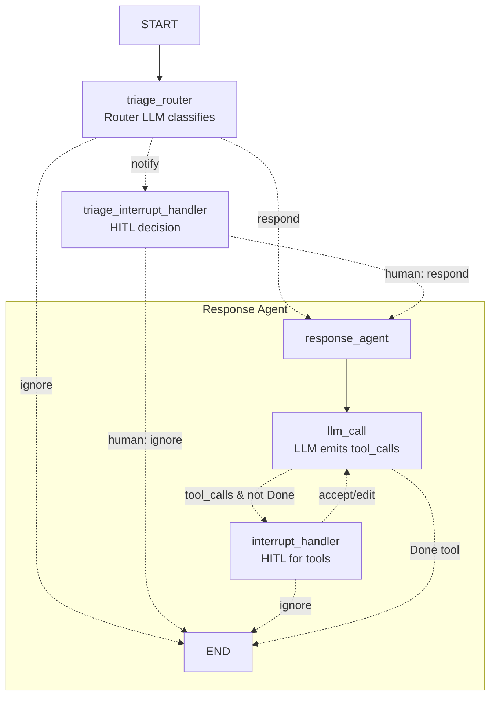
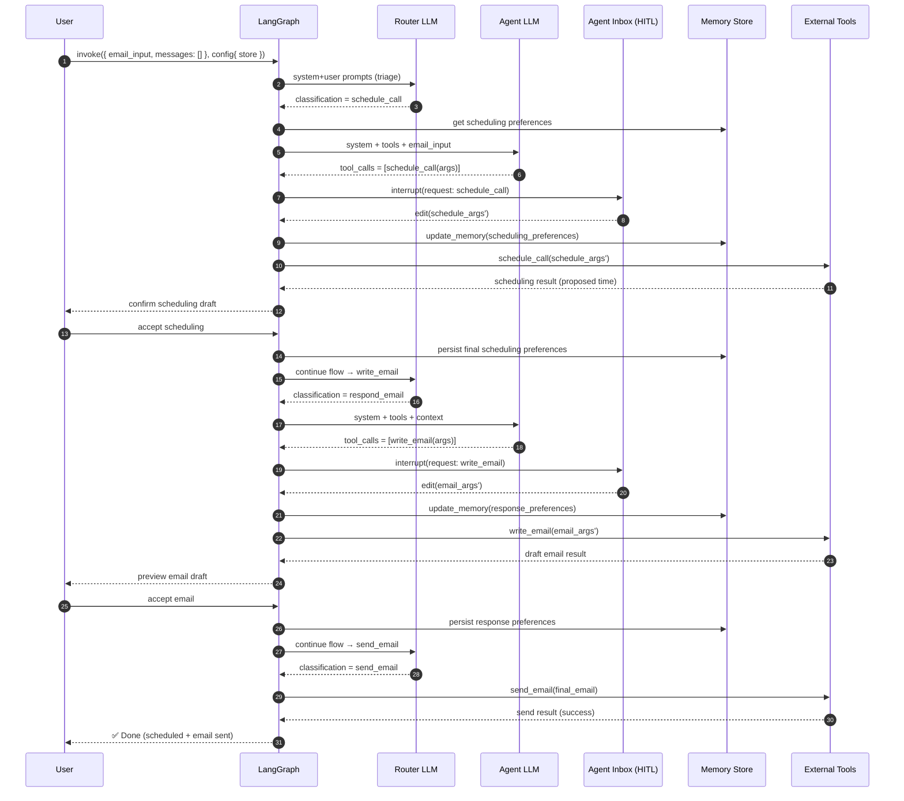

<p align="center">
  
</p>

# 📬 Email Assistant with HITL + Memory — Deep Dive

<p align="center">
  <b>🤖 Automate your inbox. 🧑‍💻 Stay in control. 🧠 Let your assistant learn from you.</b>
</p>

---

<p align="center">


</p>

---

<details>
<summary>📖 <b>Table of Contents</b> (click to expand)</summary>

1. <a href="#0-high-level-purpose">🎯 High‑Level Purpose</a>
2. <a href="#1-key-libraries--concepts">🛠️ Key Libraries & Concepts</a>
3. <a href="#2-configuration--llms">⚙️ Configuration & LLMs</a>
4. <a href="#3-memory-helpers">🧠 Memory Helpers</a>
5. <a href="#4-triage-phase-routing-the-email">📤 Triage Phase</a>
6. <a href="#5-action-phase-responding-with-tools">🔧 Action Phase</a>
7. <a href="#6-building-the-graphs">🗺️ Building the Graphs</a>
8. <a href="#7-end-to-end-data-flow-visual">🔄 End-to-End Data Flow</a>
9. <a href="#8-example-runtime-sequence">⏳ Example Runtime</a>
10. <a href="#9-how-to-run-minimal">🚀 How to Run</a>
11. <a href="#10-customization-points">🧩 Customization Points</a>
12. <a href="#11-pitfalls--best-practices">⚠️ Pitfalls & Best Practices</a>
13. <a href="#12-glossary">📚 Glossary</a>
14. <a href="#13-what-happens-on-each-outcome">🔁 What Happens on Each Outcome?</a>
15. <a href="#14-quick-mental-model">🧠 Quick Mental Model</a>

</details>

---

---

## 0) 🎯 High‑Level Purpose

You’re building an **email assistant** that:

- 📤 **Triages** incoming emails (respond / notify / ignore).
- ✍️ **Writes replies or schedules meetings** using tools.
- 🧑‍💻 Uses **Human‑in‑the‑Loop (HITL)** checkpoints so you can accept/edit/ignore actions from an **Agent Inbox** UI.
- 🧠 **Learns preferences** over time via a **store** (LangGraph `BaseStore`) updated by an LLM that outputs a **structured `UserPreferences`** model.

---

## 1) 🛠️ Key Libraries & Concepts

- **LangGraph**: Builds stateful graphs of steps (nodes) with edges and conditions.

  - `StateGraph`, `START`, `END`: define nodes and control flow.
  - `interrupt(...)`: pauses execution and surfaces a request to a human UI (Agent Inbox) and resumes when you answer.
  - `Command`: return type to instruct the graph where to go next and how to update state.

- **LangChain Google GenAI**: `ChatGoogleGenerativeAI` LLM wrapper around Gemini models.

  - `with_structured_output(...)`: forces the LLM to return data that conforms to a schema (like `RouterSchema`, `UserPreferences`).
  - `bind_tools(...)`: makes the LLM pick between available tools and emit tool calls.

- **Store (LangGraph `BaseStore`)**: a key‑value store for **long‑term memory** (preferences). You read and update it inside nodes.
- **Schemas (your `agent.schemas`)**:

  - `State`: the graph’s state (fields like `email_input`, `messages`, `classification_decision`, etc.).
  - `RouterSchema`: output of the triage router (e.g., `.classification ∈ {respond, ignore, notify}`).
  - `StateInput`: the expected input when you start the graph.
  - `UserPreferences`: the structured object used to persist preferences.

- **Tools (your `agent.tools`)**: actions the agent can take (e.g., `write_email`, `schedule_meeting`, `check_calendar_availability`, `Question`, `Done`).

---

## 2) ⚙️ Configuration & LLMs

- **Environment**: `load_dotenv(".env")` so `GOOGLE_API_KEY` is available for the Gemini models.
- **Tool registry**:

  ```py
  tools = get_tools(["write_email", "schedule_meeting", "check_calendar_availability", "Question", "Done"])
  tools_by_name = get_tools_by_name(tools)
  ```

  You keep a list of tool definitions and an index by name for quick lookups.

- **Router LLM** (classification only):

  ```py
  llm_router = ChatGoogleGenerativeAI(...).with_structured_output(RouterSchema)
  ```

  Ensures the model returns a **typed** object (e.g., `.classification`).

- **Agent LLM** (action‑oriented):

  ```py
  llm_with_tools = ChatGoogleGenerativeAI(...).bind_tools(tools, tool_choice="any")
  ```

  Lets the model choose which tool to call given the system prompt and conversation so far.

---

## 3) 🧠 Memory Helpers

### `get_memory(store, namespace, default_content=None)`

- Reads a key (`"user_preferences"`) under a **namespace tuple** like `("email_assistant", "triage_preferences")`.
- If present, returns `user_preferences.value`.
- If absent, it **initializes** the store with `default_content` and returns that.
- **Why**: Guarantees the rest of the code always has a preference profile to use.

### `update_memory(store, namespace, messages)`

- Loads the **current profile** from the store.
- Calls an LLM **with structured output** `UserPreferences` using a system prompt `MEMORY_UPDATE_INSTRUCTIONS` (filled with the current profile + namespace), plus **messages** (signals from the latest human/agent interaction).
- Writes back `result.user_preferences` to the store.
- **Why**: Lets the assistant **learn** from edits/accept/ignore decisions by the human and update long‑term behavior.

> **Tip**: Ensure your store’s values are either plain JSON‑serializable dicts or Pydantic‑model‑compatible. `store.get(...).value` should be whatever the LLM expects as `current_profile` in the prompt.

---

## 4) 📤 Triage Phase (Routing the Email)

### `triage_router(state, store) -> Command[...]`

**Goal**: Decide **respond / notify / ignore** for the input email.

**Steps**

1. **Parse the email**: `author, to, subject, email_thread = parse_email(state["email_input"])`.
2. Build **user_prompt** using `triage_user_prompt` and the parsed fields.
3. Build **email_markdown** via `format_email_markdown(...)` (nice rendering for UI/Agent Inbox).
4. Load **triage preferences** using `get_memory(..., ("email_assistant","triage_preferences"), default_triage_instructions)`.
5. Compose a **system prompt** using `triage_system_prompt.format(background=..., triage_instructions=...)`.
6. Call the **router LLM**: `result = llm_router.invoke([...])` → returns `RouterSchema` (typed).
7. Branch on `result.classification`:

   - **respond** → set `goto = "response_agent"`, add a message instructing to respond (with the markdown email included).
   - **ignore** → set `goto = END`.
   - **notify** → set `goto = "triage_interrupt_handler"` (so a human can confirm what to do).

8. Return a `Command(goto=..., update=...)` that both **moves the graph** and **updates `state`**.

### `triage_interrupt_handler(state, store) -> Command[...]`

**Goal**: When triage says **notify**, pause for human input.

**Steps**

1. Re‑parse the email and render `email_markdown`.
2. Create a **HITL request** (`request = {...}`) describing the situation and allowed actions.
3. `response = interrupt([request])[0]` → stops execution and yields control to Agent Inbox until the human responds.
4. If **human chooses `response`** (they want to reply):

   - Append a user message with their feedback.
   - **Update memory** (`triage_preferences`) to reflect that the user **does** want to respond to this type.
   - `goto = "response_agent"`.

5. If **human chooses `ignore`**:

   - Update triage memory to reflect that similar emails should be less likely to be classified as respond.
   - `goto = END`.

6. Return `Command(goto=..., update={"messages": messages})`.

---

## 5) 🔧 Action Phase (Responding with Tools)

### `llm_call(state, store)`

**Goal**: Let the model decide which tool(s) to call to handle the email.

**Steps**

1. Load **calendar** and **response** preferences from memory.
2. Build a powerful **system prompt** (`agent_system_prompt_hitl_memory`) that injects:

   - Tool usage guidelines (`HITL_MEMORY_TOOLS_PROMPT`),
   - Org background (`default_background`),
   - User’s response & calendar preferences.

3. Call `llm_with_tools.invoke([...]+state["messages"])` so the LLM can **select tools** and emit tool calls.
4. Return a dict `{ "messages": [ <AI message with tool_calls> ] }` that merges into graph state.

> The **AI message** includes `tool_calls` like `[{"name": "write_email", "args": {...}, "id": "..."}]`.

### `interrupt_handler(state, store) -> Command[...]`

**Goal**: Intercept tool calls that require **human oversight** and route them through Agent Inbox.

**Flow**

1. Initialize `result = []`, default `goto = "llm_call"` (so we can keep iterating if needed).
2. Iterate all `tool_calls` in the **last AI message**.
3. Define the **HITL whitelist**: `hitl_tools = ["write_email", "schedule_meeting", "Question"]`.

   - If a tool is **not** in the whitelist (e.g., `check_calendar_availability`), execute **immediately** and append a `{role:"tool", content: observation, tool_call_id: ...}` message.

4. For HITL tools, prepare a **rich description** containing the original email and a formatted view of the tool call (`format_for_display`).
5. Configure **allowed actions** per tool (which buttons appear in Agent Inbox):

   - `write_email` / `schedule_meeting`: allow **ignore**, **respond**, **edit**, **accept**.
   - `Question`: allow **ignore**, **respond** (no edit/accept since it’s a question).

6. Create a **HITL request** and `interrupt([request])[0]`.
7. Handle human outcomes:

   - **accept** → execute tool with original args; append the tool response.
   - **edit** → replace the tool call in the AI message with edited args, execute the tool, append the tool response, **update memory** (`response_preferences` or `cal_preferences`) with initial vs. edited.
   - **ignore** → append a tool message instructing to ignore and set `goto = END`; **update triage memory** to reduce similar future false positives.
   - **response** → human gives free‑text feedback; append a tool message containing that feedback (no execution yet); **update preferences** accordingly.

8. After processing all tool calls, return `Command(goto=goto, update={"messages": result})`.

### `should_continue(state, store)` (conditional edge)

- Looks at the **last message**. If it has any `tool_calls`:

  - If any tool is `Done` → return `END`.
  - Else → return `"interrupt_handler"` (so we run the HITL logic).

- **Note**: If the LLM returns **no tool calls**, nothing is returned here as written. Prefer to handle that explicitly (see **Pitfalls** below).

---

## 6) 🗺️ Building the Graphs

### Inner graph: `response_agent`

```py
agent_builder = StateGraph(State)
agent_builder.add_node("llm_call", llm_call)
agent_builder.add_node("interrupt_handler", interrupt_handler)
agent_builder.add_edge(START, "llm_call")
agent_builder.add_conditional_edges(
    "llm_call",
    should_continue,
    {"interrupt_handler": "interrupt_handler", END: END},
)
response_agent = agent_builder.compile()
```

- This subgraph loops: **LLM proposes tools → maybe HITL → back to LLM** until a `Done` tool or an ignore/end condition.

### Outer graph: `email_assistant_hitl_memory`

```py
overall_workflow = (
    StateGraph(State, input_schema=StateInput)
    .add_node(triage_router)
    .add_node(triage_interrupt_handler)
    .add_node("response_agent", response_agent)
    .add_edge(START, "triage_router")
)
email_assistant_hitl_memory = overall_workflow.compile()
```

- Flow: **START → triage_router →** either **END** (ignore), **triage_interrupt_handler → response_agent**, or directly **response_agent** (if `respond`).

---

## 7) 🔄 End‑to‑End Data Flow (Visual)



---

## 8) ⏳ Example Runtime (Sequence)



---

## 9) 🚀 How to Run (Minimal)

```py
from langgraph.store.memory import InMemoryStore

store = InMemoryStore()

inputs = {
    "email_input": "From: alice@example.com\nTo: you@example.com\nSubject: Meeting\n\nCan we meet tomorrow?",
    "messages": []
}

config = {
    # Needed so nodes can call `store.get/put`
    "store": store,
    # Optional: set a thread/checkpoint id if you want resumability
    "configurable": {"thread_id": "thread-123"}
}

result = email_assistant_hitl_memory.invoke(inputs, config=config)
print(result)
```

> If you’re running inside **LangGraph Studio** or any UI that supports Agent Inbox, the `interrupt(...)` calls will open review tasks. In a pure script, you need an event loop that services those interrupts (Studio handles this for you).

---

## 10) 🧩 Customization Points

- **Add/Remove tools**: change the list in `get_tools([...])`, and update the HITL allow‑lists in `interrupt_handler`.
- **Prompts**: tune `triage_system_prompt`, `triage_user_prompt`, `agent_system_prompt_hitl_memory`, and the default preference snippets.
- **Memory namespaces**: you’re using `("email_assistant", "triage_preferences"|"response_preferences"|"cal_preferences")`. Add more namespaces to learn different behaviors.
- **HITL policies**: tweak per‑tool `config` (allow_edit/accept/respond/ignore) based on risk.
- **End condition**: the `Done` tool is your explicit stop. You can also end after certain tool outputs or add safety checks.

---

## 11) ⚠️ Pitfalls & Best Practices

1. **`should_continue` when there are no tool calls**: currently returns nothing (implicit `None`). Add a default:

   ```py
   def should_continue(state, store):
       last = state["messages"][-1]
       if getattr(last, "tool_calls", None):
           for tc in last.tool_calls:
               if tc["name"] == "Done":
                   return END
           return "interrupt_handler"
       return END  # or a node that builds a plain text reply
   ```

2. **Store value shape**: Make sure `store.get(...).value` matches what your prompts expect. If your store returns the raw object, you may need `json.dumps(...)` or `.model_dump()` when formatting prompts.
3. **Schema consistency**: Verify your `RouterSchema` fields line up with usage (`.classification`).
4. **Tool execution side effects**: Tools like `schedule_meeting` should be idempotent or guarded—avoid accidental double‑booking when the user edits/accepts.
5. **Error handling**: Wrap tool invocations in try/except to return helpful tool error messages back to the graph.
6. **LLM determinism**: You set `temperature=0.0`—good for predictability.
7. **Security**: Sanitize any content you inject into prompts (avoid prompt‑injection via email content).

---

## 12) 📚 Glossary

- **HITL**: Human‑in‑the‑Loop—pausing the agent to ask a person before proceeding.
- **Agent Inbox**: UI where interrupts show up; you can accept/edit/ignore.
- **Namespace**: A tuple key segment for the store, e.g., `("email_assistant", "triage_preferences")`.
- **Structured Output**: Forcing LLM to return data conforming to a Pydantic schema.

---

## 13) 🔁 What Happens on Each Outcome?

- **Triage = ignore** → Flow ends; memory can be updated later based on future interactions.
- **Triage = notify** → HITL asks you; your response updates triage preferences.
- **Triage = respond** → Agent proposes tool calls; HITL validates risky ones.
- **HITL accept** → Execute tool.
- **HITL edit** → Execute tool with edits, then learn from the delta.
- **HITL ignore** → End flow and learn to avoid similar cases.
- **HITL response** → Capture feedback; optionally loop to get a better draft before executing.

---

## 14) 🧠 Quick Mental Model

1. **Classify** the email.
2. **If needed, ask a human** about the classification.
3. **Act** (write/schedule) with tools chosen by the model.
4. **Ask a human** before risky actions.
5. **Learn** from the human’s decisions.
6. **Repeat** until `Done` or the human says stop.

---

---

<p align="center">
  <b>✨ If you want, we can also <i>annotate your exact code</i> inline (adding comments to each line) or run through a <i>concrete email example</i> end‑to‑end with sample Agent Inbox interactions. ✨</b>
</p>
